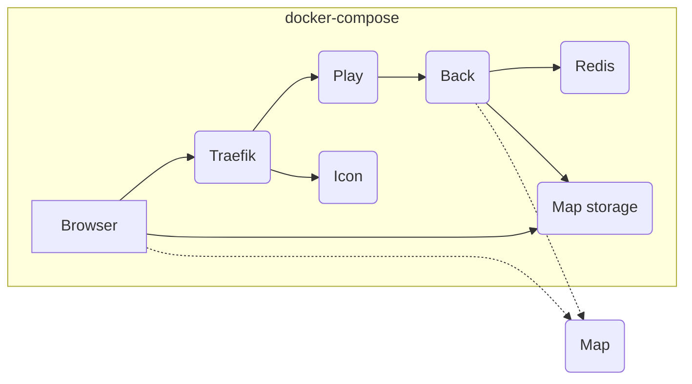

# Auto-hospedagem do WorkAdventure usando o Docker Compose

> [!AVISO]
> Se você ainda não o fez, consulte o guia [Configurando um ambiente de produção auto-hospedado](../../docs/others/self-hosting/install.md)
> antes de começar.

## Requisitos de hardware

Para executar a instalação, você precisará de um servidor, com um nome de domínio apontando para o servidor.
Um servidor relativamente pequeno (2 CPUs, 4 GB de RAM) permitirá que você hospede reuniões com até 300 usuários simultâneos.

O servidor WorkAdventure em si não precisa de muitos recursos. No entanto, os servidores Coturn e Jitsi precisarão ser
muito mais poderosos, pois estão lidando com os fluxos de vídeo. Consulte a documentação do Jitsi e do Coturn para dimensionar corretamente
esses servidores.

> [!AVISO]
> O WorkAdventure usa WebRTC para conexões de áudio/vídeo. O WebRTC, por sua vez, exige uma conexão HTTPS com um
> certificado válido. Como resultado, você precisa de um nome de domínio apontando para seu servidor. Você não pode acessar o WorkAdventure diretamente
> pelo endereço IP do servidor, pois o certificado HTTPS só pode ser emitido para um nome de domínio.

## A estrutura de instalação padrão

O arquivo docker-compose padrão está disponível aqui: [`docker-compose.prod.yaml`](docker-compose.prod.yaml).

Neste arquivo docker-compose, você encontrará:

- Um proxy reverso (Traefik) que despacha solicitações para os contêineres do WorkAdventure e manipula a terminação HTTPS. Os certificados HTTPS serão gerados automaticamente usando LetsEncrypt.
- Um contêiner de jogo (NodeJS) que serve arquivos estáticos para o "jogo" (HTML/JS/CSS) e é o ponto de entrada para os usuários (você pode iniciar muitos se quiser aumentar o desempenho)
- Um contêiner de retorno (NodeJS) que compartilha as informações das suas salas
- Um contêiner de armazenamento de mapas (NodeJS) que serve seus mapas e fornece recursos de edição de mapas
- Um contêiner de ícones para buscar o favicon de sites importados em iframes
- Um servidor Redis para armazenar valores de variáveis ​​originadas da API de script



> **Observação**
> Você pode hospedar seus mapas no próprio servidor WorkAdventure (usando o contêiner de armazenamento de mapas dedicado) ou fora
> do servidor WorkAdventure, em qualquer [servidor HTTP configurado corretamente](../../docs/maps/hosting.md) (Nginx, Apache...).
> O arquivo docker-compose padrão **não** contém um contêiner dedicado à hospedagem de mapas. A documentação e

## Começando

> **Observação**
> Estas instruções de instalação são apenas para produção. Se você estiver procurando instalar o WorkAdventure
> em sua máquina de desenvolvimento local, vá para o [README principal](../../README.md).

### 1. Instale o Docker

No seu servidor, instale a versão mais recente do Docker, junto com o docker-compose.

### 2. Copie os arquivos de implantação

Copie o arquivo [`.env.prod.template`](.env.prod.template) no seu servidor e renomeie-o para `.env`.
Copie o arquivo [`docker-compose.prod.yaml`](docker-compose.prod.yaml) no seu servidor e renomeie-o para `docker-compose.yaml`.

### 3. Configure seu ambiente

Edite o arquivo `.env`.

Para que seu ambiente seja iniciado, você precisará pelo menos configurar:

- **VERSION**: a versão do WorkAdventure a ser instalada. Veja abaixo para mais informações.
- **SECRET_KEY**: uma chave aleatória usada para gerar segredos JWT
- **DOMAIN**: seu nome de domínio (sem nenhum prefixo "https://")
- **MAP_STORAGE_AUTHENTICATION_USER**: o nome de usuário para o contêiner de armazenamento de mapas
- **MAP_STORAGE_AUTHENTICATION_PASSWORD**: a senha para o contêiner de armazenamento de mapas

Fique à vontade para procurar as outras variáveis ​​de ambiente e modificá-las de acordo com suas preferências.

**Selecionando a versão correta:**

Por padrão, a `VERSION` no arquivo `.env` é definida como "master". Isso significa que estamos mirando na versão estável mais recente.

É importante **mudar isso**.

De fato, a tag "master" está evoluindo ao longo do tempo e, em algum momento, novas variáveis ​​de ambiente podem ser necessárias, ou novos
contêineres podem ser necessários. Se você mantiver a VERSÃO fixada em "master", em algum momento, seu arquivo `docker-compose.yaml`
ficará fora de sincronia com as imagens.

Para evitar esse problema, use uma tag válida para a `VERSÃO`.

A lista de tags está disponível na [página de lançamentos](https://github.com/thecodingmachine/workadventure/releases/).

> **Aviso**
> A VERSÃO usada no arquivo `.env` deve corresponder ao `docker-compose.prod.yaml` usado.
> Então, se você baixou o `docker-compose.prod.yaml` da versão "v1.15.3", use `VERSION=v1.15.3`
> no arquivo `.env`.

### 4. Iniciando o ambiente

No diretório que contém seu arquivo `docker-compose.yaml` e seu arquivo `.env`, basta usar:

```console
docker-compose up -d
```

Você pode verificar os logs com:

```console
docker-compose logs -f
```

### 5. Carregando seu primeiro mapa

Antes de começar a usar o WorkAdventure, você precisará carregar seu primeiro mapa.

#### Carregando do kit inicial do mapa

Crie seu próprio mapa usando o [kit inicial do mapa](https://github.com/workadventure/map-starter-kit).
Quando estiver satisfeito com o resultado, [siga os passos em "carregar sua documentação de mapa"](https://docs.workadventu.re/map-building/tiled-editor/publish/wa-hosted)

#### Verificando se tudo funcionou

Abra seu navegador e vá para `https://<seu-domínio>/map-storage/`.

Você será solicitado a autenticar. Use as credenciais que você configurou no arquivo `.env`.

> **Observação**
> No momento, a autenticação é limitada a uma única credencial de usuário no contêiner de armazenamento de mapa,
> codificado no arquivo `.env`. Isso não é o ideal, mas funciona por enquanto (o contêiner de armazenamento de mapa
> é bem novo). Contribuições são bem-vindas se você quiser melhorar isso.

Você deve ver um link para o mapa que você acabou de carregar.

Você está conectado? Parabéns! Compartilhe a URL com seus amigos e comece a usar o WorkAdventure!

Não está funcionando? Vá para a [seção de solução de problemas](#solução de problemas).

### Etapas pós-instalação

Agora você pode personalizar sua instância do WorkAdventure modificando o arquivo `.env`.

Certifique-se de configurar o Jitsi, pois é a solução de videoconferência padrão para salas grandes,
e as configurações do Turn para garantir que o vídeo seja retransmitido corretamente, mesmo se seus clientes estiverem em uma rede restrita.

Manter seu servidor seguro também é importante. Você pode configurar a variável de ambiente `SECURITY_EMAIL`
para receber notificações de segurança da equipe principal do WorkAdventure.
Você será notificado se sua versão do WorkAdventure contiver uma falha de segurança conhecida.

#### Adicionando autenticação

O WorkAdventure não fornece seu próprio sistema de autenticação. Em vez disso, você pode conectar o WorkAdventure a um provedor de autenticação OpenID Connect
(como Google, GitHub ou qualquer outro provedor).

Se você quiser conectar o WorkAdventure a um provedor de autenticação, você pode seguir a [documentação do OpenID Connect](../../docs/dev/openid.md).

Quando o OpenID estiver configurado, você deve configurar uma lista de usuários restritos [com permissão para acessar o editor de mapas em linha](../../docs/dev/inline-map-editor.md).

#### Conectando-se a um servidor de bate-papo

O WorkAdventure pode se conectar a um [servidor Matrix](https://matrix.org/) para fornecer recursos de bate-papo.
O Matrix é um protocolo de bate-papo descentralizado que permite que você hospede seu próprio servidor de bate-papo.

Com a integração do Matrix configurada, você pode bater papo com outros usuários, mesmo quando eles não estiverem conectados ao WorkAdventure.
Por exemplo, um usuário pode conversar com você de um cliente Matrix como o Element em seu celular, enquanto você está no WorkAdventure.

Você pode seguir a [documentação do Matrix](../../docs/others/self-hosting/matrix.md) para aprender como configurar seu servidor Matrix
e conectá-lo ao WorkAdventure.

## Atualizando o WorkAdventure

O caminho de atualização dependerá da instalação do WorkAdventure que você está usando.

#### Se você estiver usando o arquivo `docker-compose.prod.yaml` sem nenhuma alteração:

- Baixe o `docker-compose.prod.yaml` para a versão para a qual deseja atualizar e substitua-o em seu servidor
- Agora, edite o arquivo `.env` e altere a `VERSION` para a versão correspondente.
- Leia as notas de atualização para a versão para a qual você está atualizando (consulte a [página de lançamentos](https://github.com/thecodingmachine/workadventure/releases/)),
e aplique quaisquer alterações, se necessário (isso pode ser uma variável adicional para adicionar ao arquivo `.env`)

Então, simplesmente execute:

```console
docker-compose up -d --force-recreate
```

#### Se você estiver usando um método de implantação personalizado:

O caminho de atualização dependerá, é claro, do seu método de implantação. Aqui estão algumas dicas para facilitar:

- Baixe o `docker-compose.prod.yaml` para a versão para a qual deseja atualizar.
- Baixe o `docker-compose.prod.yaml` para sua versão atual.
- Compare os dois arquivos. As diferenças serão as alterações que você precisa aplicar ao seu método de implantação.

## Solução de problemas

Em caso de problemas, verifique se todos os seus contêineres foram iniciados com:

```console
docker-compose ps
```

Todos os contêineres devem estar em execução. Se um não estiver, verifique os logs do contêiner com:

```console
docker-compose logs [container-name]
```

Você também pode usar os logs de todos os contêineres com:

```console
docker-compose logs -f
```
